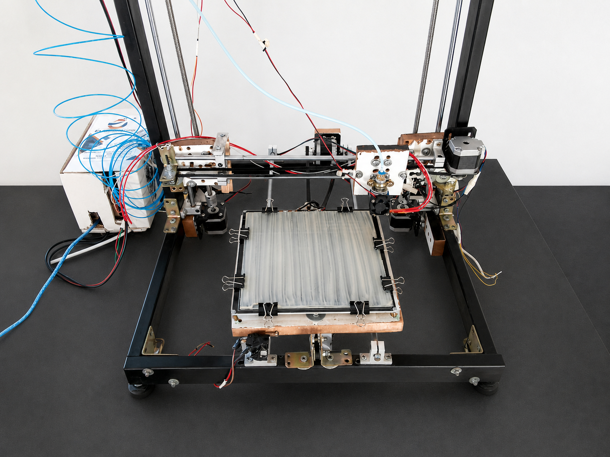
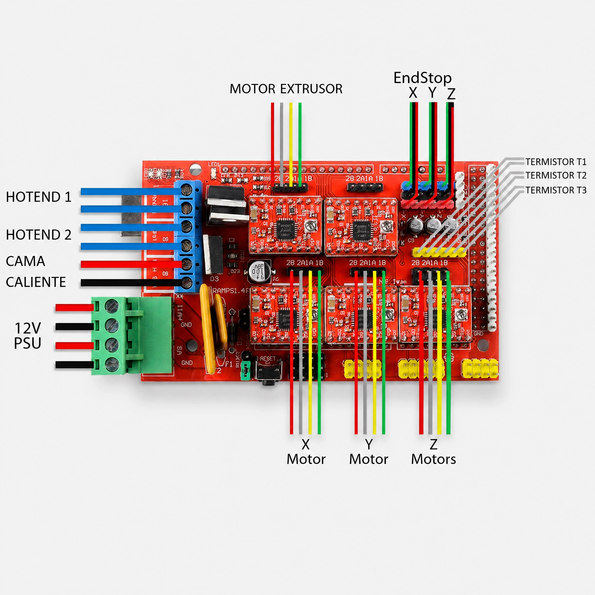

# DIY 3D Printer

Projet d'imprimante 3D DIY avec une électronique RAMPS 1.4 et un firmware Marlin 1.1.x personnalisé.

## Stack

- Firmware : Marlin 1.1.x personnalisé
- Électronique : RAMPS 1.4
- Slicer : Slic3r / Ultimaker Cura

## Photos

## Démo

